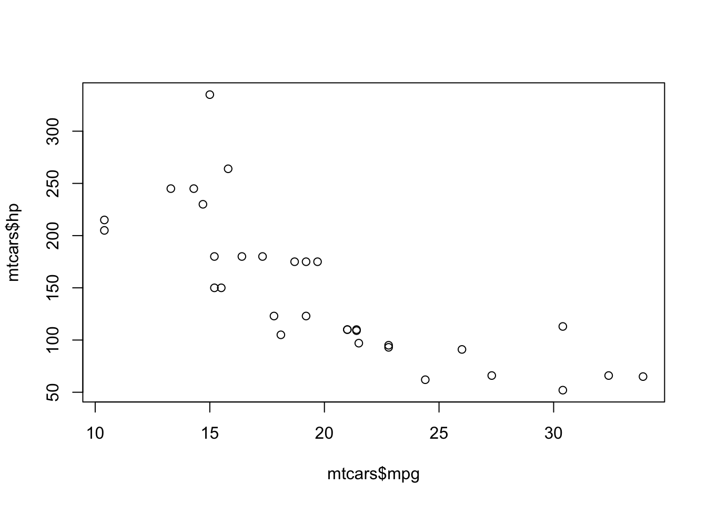

## Markdown figure

{#fig-md
  fig-notes="Markdown-figure notes below the caption."
  width=60%}

## Executable cell

```{r}
#| label: fig-chunk
#| fig-cap: "Chunk caption at the bottom."
#| fig-notes: "Chunk notes below the caption."
#| echo: false
plot(mtcars$mpg, mtcars$hp)
```

## Table

| fruit  | price |
|--------|-------|
| apple  | 2.05  |
| pear   | 1.37  |

: Fruit prices. {#tbl-fruit tbl-notes="Table notes in the footer."}
